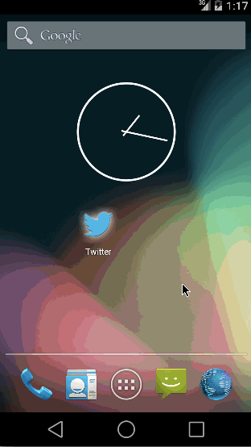

# A Simple Twitter Client

## Required Stories

* User can sign in to Twitter using OAuth login
* User can view the tweets from their home timeline
User should be able to see the username, name, body and timestamp for each tweet
User should be displayed the relative timestamp for a tweet "8m", "7h"
User can view more tweets as they scroll with infinite pagination

* User can compose a new tweet
* User can click a “Compose” icon in the Action Bar on the top right
* User can then enter a new tweet and post this to twitter
* User is taken back to home timeline with new tweet visible in timeline

===

## Sprint 2

* User can switch between Timeline and Mention views using tabs.
* User can view their home timeline tweets.
* User can view the recent mentions of their username.
* User can scroll to bottom of either of these lists and new tweets will load ("infinite scroll")

* User can navigate to view their own profile
* User can see picture, tagline, # of followers, # of following, and tweets on their profile.
* User can click on the profile image in any tweet to see another user's profile.
* User can see picture, tagline, # of followers, # of following, and tweets of clicked user.
* Profile view should include that user's timeline

## Sprint 3

* Style the login screen for twitter
* Pick a good Twitter launcher icon
* Properly theme the ActionBar with correct text and background colors
* Theme the tabs to fit a "twitter" color scheme
* On compose screen, the "post" button should be customized (images or drawables) with a pressed state
* Add inline "favorite" and "reply" icons to each tweet. Favorite icon should toggle when pressed.

#Advanced

* Advanced: Improve the user interface and theme the app to feel twitter branded

